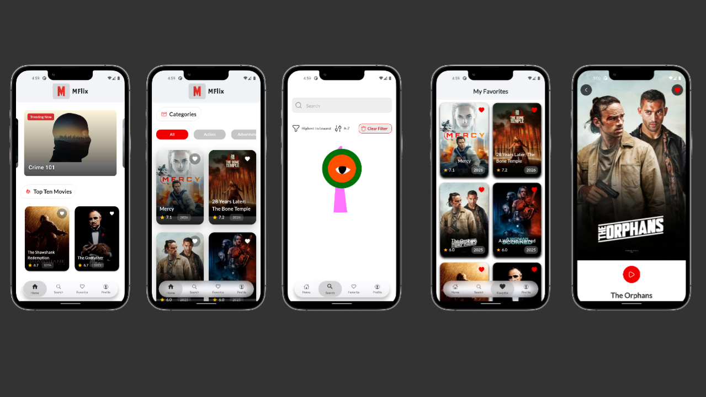
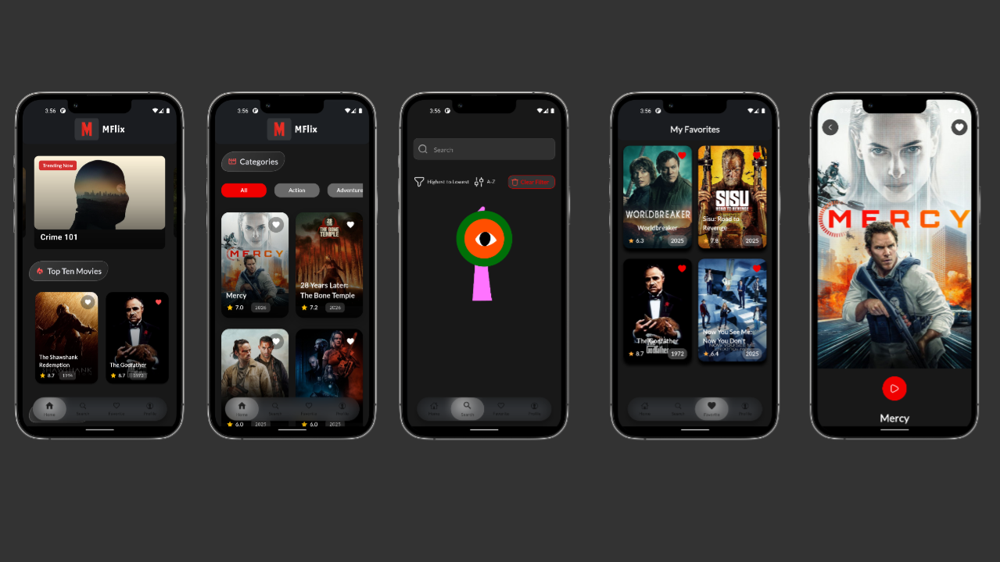
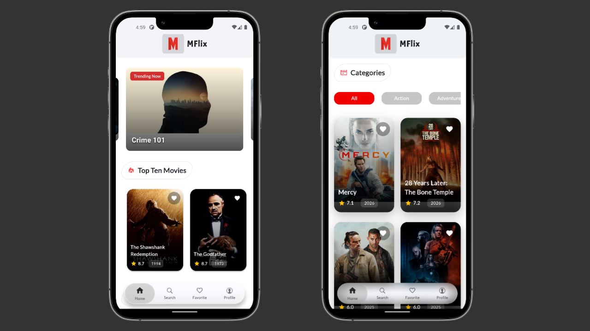
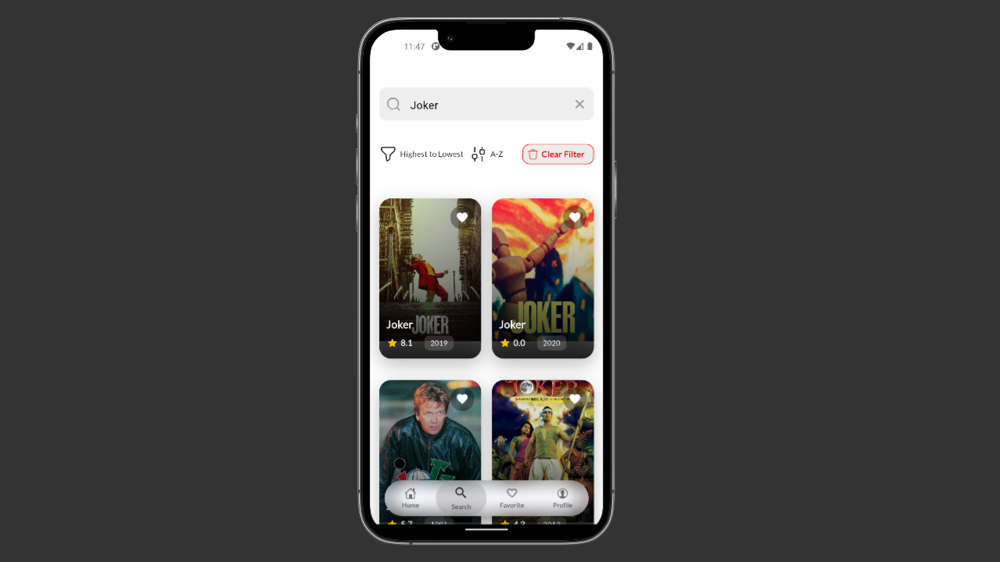
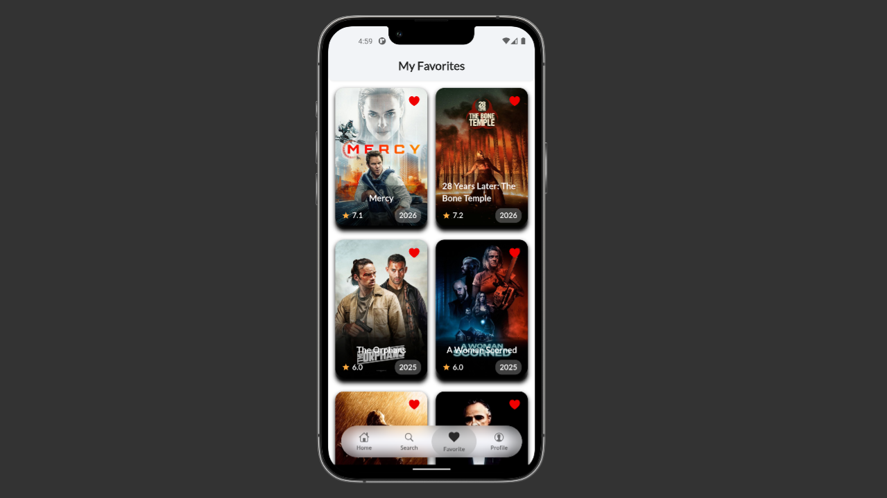
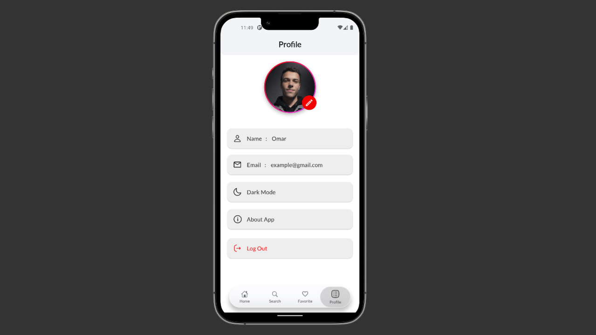
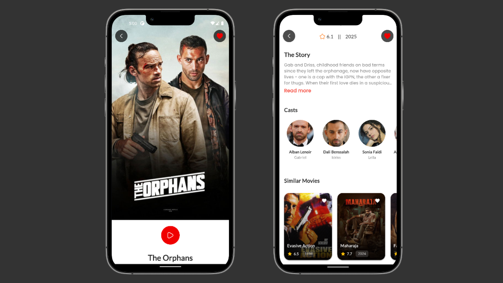
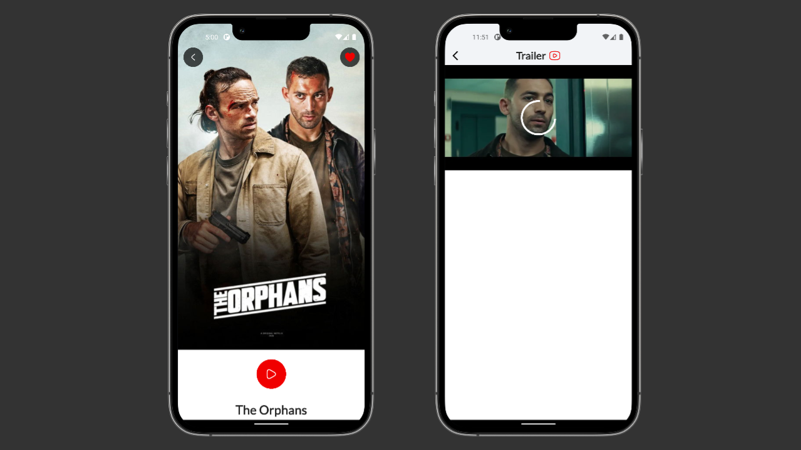
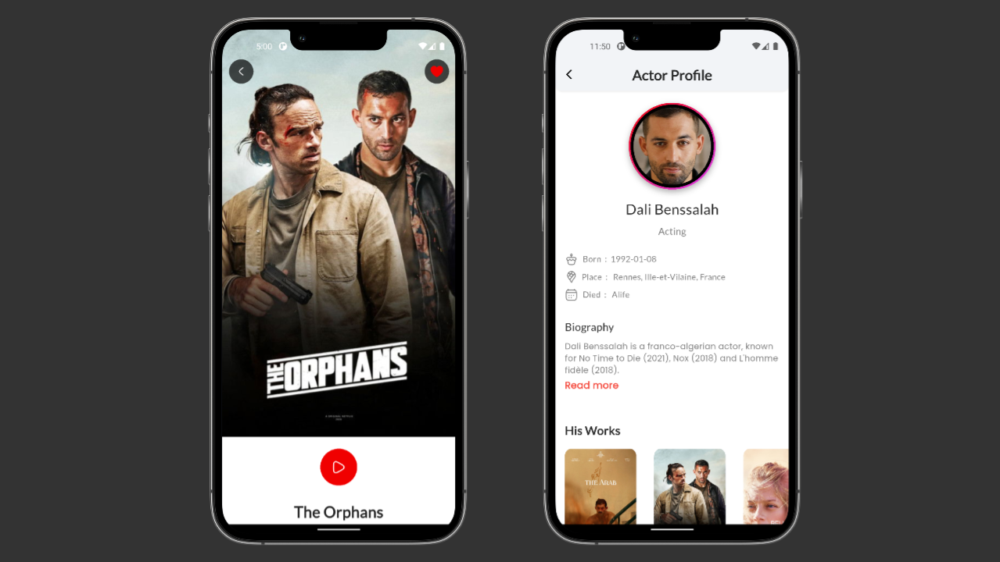

# 🎬 Movie App

A modern and clean Movie Application that allows users to explore movies, watch trailers, browse categories, search for films, manage favorites, and authenticate users — with full Dark & Light mode support 🌙☀️

---

## 📱 App Preview

### ☀️ Light Mode

---

### 🌙 Dark Mode

---

# 🔐 Authentication

Secure user authentication system with clean and modern UI.

- User Login  
- User Registration  
- Form Validation  
- Secure Input Fields  
- Protected Navigation  

---

# 📸 App Screenshots

## 🏠 Home Screen

---

## 🔍 Search Screen

---

## ❤️ Favorites Screen

---

## 👤 User Profile Screen

---

## 🎬 Movie Details Screen

---

## ▶️ Movie Details & Trailer

---

## 🎭 Actor Profile Screen

---

# 🚀 Features

- 🎞 Movie Banner Section  
- 🔟 Top 10 Movies  
- 🎭 Browse by Categories  
- 🔍 Smart Search Functionality  
- ❤️ Add / Remove Favorites  
- 👤 User Profile  
- 🎬 Movie Details with Cast  
- ▶️ Watch Movie Trailer  
- 🎭 Actor Profile with Known Works  
- 🔐 Authentication (Login / Sign Up)  
- 🌗 Dark & Light Mode Support  
- 🧭 Bottom Navigation Bar  

---

# 🛠 Tech Stack

- Flutter  
- REST API Integration  
- State Management  
- Clean Architecture  
- Responsive UI  